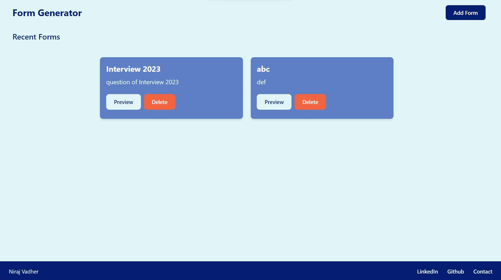
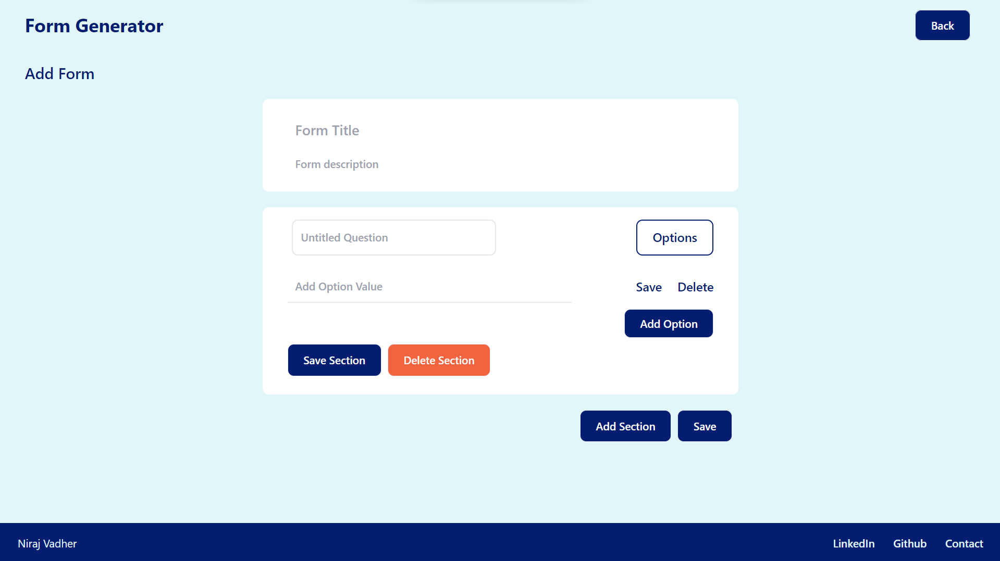
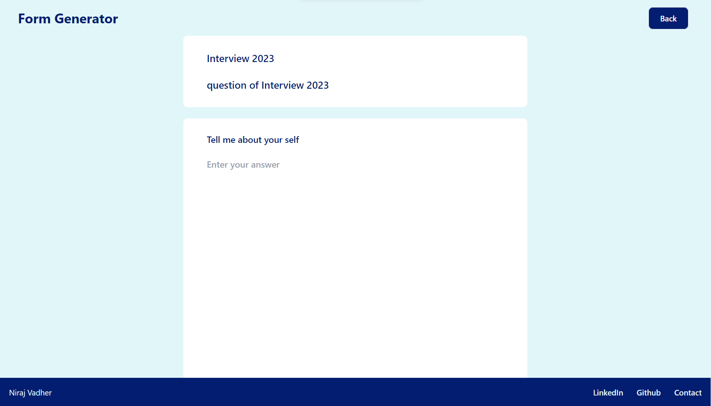
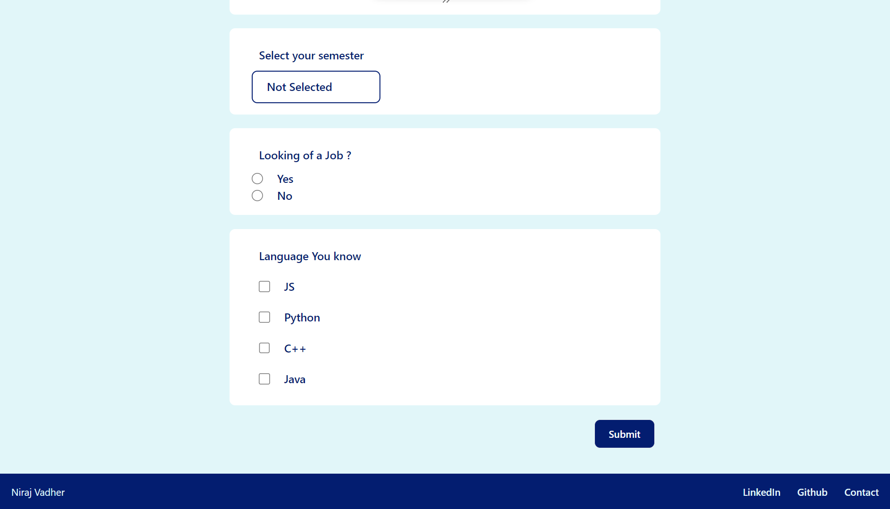

# Form Generator

### Problem Statement

Your task is to create a dynamic form generator application using React.js. The application should allow users to create custom forms with various types of form fields, such as text inputs, dropdowns, checkboxes, and radio buttons.

Key Requirements:

- Users should be able to add and remove form fields dynamically.
- Each form field should have a label and a corresponding component based on the field
  type.
- Users should be able to specify the type of each form field. Fields to be supported: text
  input, text area, dropdown, checkbox, radio button.
- For dropdown fields, users should be able to define a set of options to choose from.
- The application should support form submission and validation, displaying error
  messages for invalid fields.
- Users should be able to save and load form configurations as JSON data. (Here the form
  fields configuration needs to be saved as JSON)

## Setup Instructions
1. Git clone the repo

2. Run below commands
    - ```npm install```

3. Run the development server
    - ```npm run dev```

4. Open [http://localhost:3000/](http://localhost:3000/) to see the website


## Solution

- The project's data structure was designed to store forms in JSON format. Here is a sample structure:

```
{
    form : [
        {
            title : "Student Information",
            descriptions:"Add your marks",
            formfields: [
                {
                    title : "Add your 10th marks",
                    type : "TextArea , drop down , check box , radio button, Text",
                    options : ["1","2"]
                },
                {
                    title : "Add your 11th marks",
                    type : "TextArea , drop down , check box , radio button, Text",
                    options : ["1","2"]
                }
            ]
        },
    ]
}

```

- This structured JSON format allows for the storage of form templates with titles, descriptions, and individual form fields.

### Project Implementation

The project's implementation involved creating various components and routes in the Next.js application. Some of the key features and components included:

- **_Form Generator Component_**: A component that allows users to create forms interactively.

- **_Form Fields_**: The ability to add different types of form fields, such as text areas, dropdowns, checkboxes, radio buttons, and text inputs.

- **_Data Storage_**: The application used the browser's local storage to save and retrieve form data in the structured JSON format.

- **_Data Validation_**: Implemented form data validation, including checking for minimum word counts and option selections.

- **_Preview Functionality_**: A form preview feature to visualize the created form.

- ***Submitting Forms***: Users could submit their forms, which will be saved as JSON in localStorage.

- ***Responsive Design***: The form generator is designed to provide an optimal user experience across a variety of devices, including desktops, tablets, and mobile devices.

### Routes

- `/`
- `/addform`
- `/preview`

### Technologies Used

- HTML
- Tailwind CSS
- NEXTJS (_Why NextJS? Assessment has mentioned ReactJS_)
  - Because, the offically documentation of ReactJS recommend us to use NEXTJS
  - _From Offical Documentation:_ If you want to build a new app or a new website fully with React, we recommend picking one of the React-powered frameworks popular in the community (NEXTJS).
- uuid
- React-toastify

## Screen Shots









### Conclusion
The project successfully achieved the goal of creating a form generator and data storage system using a structured JSON format. This project can be further extended to include additional features and capabilities, making it a valuable tool for various applications requiring dynamic form creation and management.

### Future Work
1. Multiple FormFields of the Same Type
2. Form Submission Count and Response Tracking
3. User Authentication
4. Pre-design Form Templates
5.  Export data and Report Creation